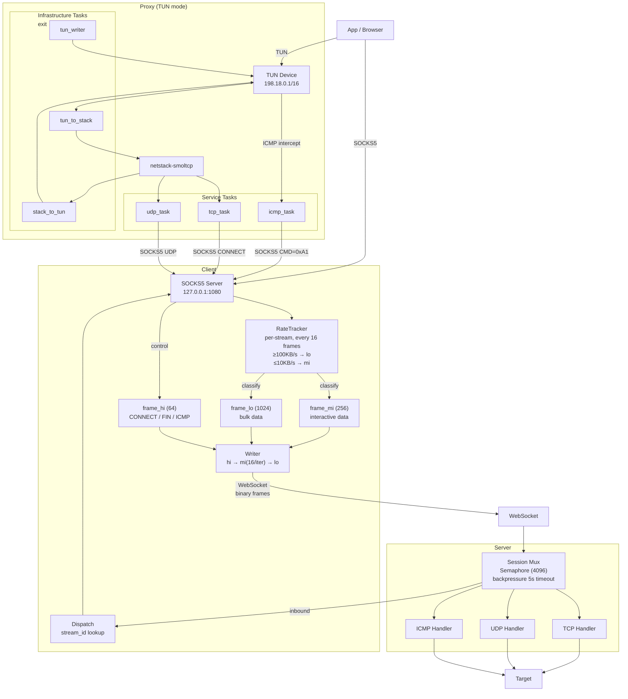

<p align="center">
  <p align="center"></p>
  <h1 align="center">OmniProxy</h1>
  <p align="center">A self-hosted transparent proxy suite. Written in pure Rust — each binary is ~2 MB, zero dependencies, minimal CPU and memory footprint.</p>
</p>

<p align="center">
  <strong>English</strong> · <a href="README.zh-CN.md">中文</a>
</p>

<p align="center">
  <a href="https://github.com/kurashizu/OmniProxy/releases"></a>
  <a href="LICENSE"></a>
</p>

---

| Binary | Role |
|--------|------|
| **server** | WebSocket relay — deploy on a VPS, container platform, or any internet-connected machine |
| **client** | SOCKS5 proxy — runs on your local machine, multiplexes TCP/UDP/ICMP over a single WebSocket |
| **proxy** | TUN forwarder — creates a virtual interface and routes all system traffic through the client |

```
Apps → [proxy] (optional) → [client] —WebSocket→ [server] —TCP/UDP/ICMP→ target
```

## Quick Start

**1. Download** — Get the latest release from [GitHub Releases](https://github.com/kurashizu/OmniProxy/releases).

**2. Deploy the server** — Start the WebSocket relay on any machine with internet access:
```bash
./server --addr 0.0.0.0 --port 9880 --token your-token
# or via Docker
SERVER_TOKEN=your-token docker compose up -d
```

The server listens on port 9880. Expose it directly, or behind a CDN tunnel (e.g. Cloudflare Tunnel) if you don't have a public IP.

**3. Run the client** — Start the SOCKS5 proxy on your local machine:
```bash
./client --config config.yml
```
Then set your browser or system proxy to `127.0.0.1:1080` (SOCKS5).

**Transparent proxy (optional)** — Route all system traffic through the TUN forwarder:
```bash
sudo ./proxy --config ./config.yml
```

> **macOS:** Run `chmod +x * && ./setup_macos.sh` once to bypass Gatekeeper.
> **Windows:** Run `proxy.exe --config config.yml` as Administrator (requires [Wintun](https://www.wintun.net/)).

## Deployment Options

The **server** can be deployed in three ways:

| Method | Description |
|--------|-------------|
| **VPS** | Run the binary directly on any Linux VPS (~2 MB static binary, zero deps) |
| **Container platform** | Push to Render, Railway, Fly.io, etc. using the pre-built image |
| **Any machine + CDN tunnel** | Run behind NAT and expose via Cloudflare Tunnel or similar |

### Container platform

```yaml
services:
  server:
    image: ghcr.io/kurashizu/omniproxy/omniproxy-server:latest
    ports:
      - "${SERVER_PORT:-9880}:9880"
    environment:
      - SERVER_TOKEN=${SERVER_TOKEN:-}
    cap_add:
      - NET_RAW
    restart: unless-stopped
```

Pre-built images: [`ghcr.io/kurashizu/omniproxy/omniproxy-server`](https://github.com/kurashizu/OmniProxy/pkgs/container/omniproxy%2Fomniproxy-server).

Local build: `docker compose build` or `docker build -t omniproxy-server .`

> **ICMP:** For ping passthrough, the server needs `CAP_NET_RAW` (`sudo setcap cap_net_raw+ep server`) or root. Docker's `cap_add: NET_RAW` handles this.

## Configuration

### client/config.yml

```yaml
addr: 127.0.0.1
port: 1080
token: "your-token"
server: "proxy.example.com"
```

### server/config.yml

```yaml
addr: 0.0.0.0
port: 9880
token: "your-token"
```

### proxy/config.yml

```yaml
client: "./client"
server: "proxy.example.com"
token: "your-token"
socks_port: 1080
tun_name: "tun0"           # Linux: tun0 | macOS: utun100 | Windows: tun0
tun_ip: "198.18.0.1"
tun_prefix: 16
```

## TUN Mode

Routes all system traffic through the proxy by creating a virtual network interface.

1. Creates a TUN interface with IP `198.18.0.1/16` (IPv4) and `fd00::1/64` (IPv6)
2. Routes all traffic through the TUN via split default routes (`0.0.0.0/1` + `128.0.0.0/1`)
3. The forwarder reads packets from TUN, extracts the destination, and sends them to the local SOCKS5 client (DNS is resolved server-side)
4. The client multiplexes everything over WebSocket to the server

**Important:** The TUN IP ranges `198.18.0.0/16` and `fd00::/64` must not conflict with your local network.

## Architecture

```
Browser/App → SOCKS5 client (127.0.0.1:1080) → WebSocket → server → target
```



**client** — SOCKS5 proxy that multiplexes TCP/UDP/ICMP over a persistent WebSocket. Three priority queues (control > interactive > bulk) with per-stream rate tracking and automatic reclassification.

**server** — WebSocket relay that demultiplexes streams to target TCP/UDP endpoints. 4096-stream concurrency limit with per-stream 5s backpressure.

**proxy** — TUN forwarder that routes all system traffic through the client. Infrastructure tasks (TUN I/O, netstack) are separated from service tasks (TCP/UDP/ICMP) — a single protocol failure doesn't tear down the entire tunnel.

## Wire Protocol

| Type | Name | Direction | Description |
|------|------|----------|-------------|
| 0x01 | TCP_CONNECT | C→S | New TCP stream |
| 0x02 | TCP_CONNECTED | S→C | Connection result |
| 0x03 | TCP_DATA | both | Payload |
| 0x04 | TCP_FIN | C→S | Stream closed |
| 0x05 | UDP_DATA | C→S | UDP packet |
| 0x06 | ICMP_DATA | C→S | ICMP echo |

UDP payload: `[2B host_len][host bytes][2B port][data]`

ICMP payload: `[2B ip_len][ip string][icmp_data]`

## Requirements

- Rust 1.85+ (edition 2024) for building from source
- TUN mode: TUN/TAP support + root/admin privileges
- Server ICMP: `CAP_NET_RAW` or root (Linux)

## License

WTFPL
