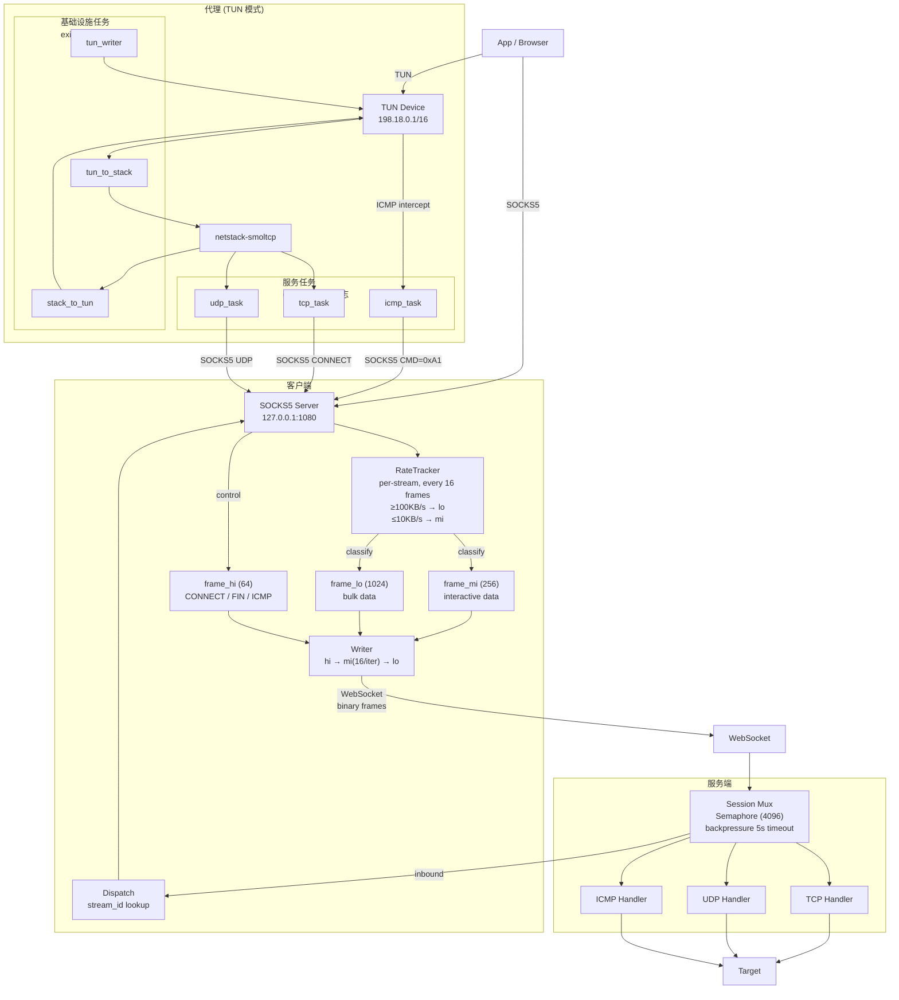

<p align="center">
  <p align="center"></p>
  <h1 align="center">OmniProxy</h1>
  <p align="center">一个自托管的透明代理套件。纯 Rust 编写，每个二进制文件仅 ~2 MB，零依赖，极低的 CPU 和内存占用。</p>
</p>

<p align="center">
  <a href="README.md">English</a> · <strong>中文</strong>
</p>

<p align="center">
  <a href="https://github.com/kurashizu/OmniProxy/releases"></a>
  <a href="LICENSE"></a>
</p>

---

| 二进制 | 功能 |
|--------|------|
| **server** | WebSocket 中继 — 部署在 VPS、容器平台或任意可上网的机器上 |
| **client** | SOCKS5 代理 — 运行在本机，将 TCP/UDP/ICMP 多路复用到单个 WebSocket |
| **proxy** | TUN 转发器 — 创建虚拟网卡，通过 client 路由所有系统流量 |

```
应用 → [proxy]（可选）→ [client] —WebSocket→ [server] —TCP/UDP/ICMP→ 目标
```

## 快速开始

**1. 下载** — 从 [GitHub Releases](https://github.com/kurashizu/OmniProxy/releases) 获取最新版本。

**2. 部署服务端** — 在任意可上网的机器上启动 WebSocket 中继：
```bash
./server --addr 0.0.0.0 --port 9880 --token your-token
# 或通过 Docker
SERVER_TOKEN=your-token docker compose up -d
```

服务端监听 9880 端口。可直接暴露端口，或用 CDN 隧道（如 Cloudflare Tunnel）穿透到内网机器。

**3. 运行客户端** — 在本机启动 SOCKS5 代理：
```bash
./client --config config.yml
```
然后将浏览器或系统代理设为 `127.0.0.1:1080`（SOCKS5）。

**透明代理（可选）** — 通过 TUN 转发器路由所有系统流量：
```bash
sudo ./proxy --config ./config.yml
```

> **macOS：** 先运行 `chmod +x * && ./setup_macos.sh` 以绕过 Gatekeeper。
> **Windows：** 以管理员权限运行 `proxy.exe --config config.yml`（需要 [Wintun](https://www.wintun.net/) 驱动）。

## 部署方式

服务端有三种部署方式：

| 方式 | 说明 |
|------|------|
| **VPS** | 直接运行二进制（~2 MB 静态链接，零依赖） |
| **容器平台** | 在 Render、Railway、Fly.io 等平台使用预构建镜像 |
| **任意机器 + CDN 隧道** | 内网机器运行服务端，通过 Cloudflare Tunnel 暴露 |

### 容器平台

```yaml
services:
  server:
    image: ghcr.io/kurashizu/omniproxy/omniproxy-server:latest
    ports:
      - "${SERVER_PORT:-9880}:9880"
    environment:
      - SERVER_TOKEN=${SERVER_TOKEN:-}
    cap_add:
      - NET_RAW
    restart: unless-stopped
```

预构建镜像：[`ghcr.io/kurashizu/omniproxy/omniproxy-server`](https://github.com/kurashizu/OmniProxy/pkgs/container/omniproxy%2Fomniproxy-server)。

本地构建：`docker compose build` 或 `docker build -t omniproxy-server .`

> **ICMP：** 如需启用 ping 透传，服务端需要 `CAP_NET_RAW`（`sudo setcap cap_net_raw+ep server`）或 root。Docker 的 `cap_add: NET_RAW` 已处理。

## 配置

### client/config.yml

```yaml
addr: 127.0.0.1
port: 1080
token: "your-token"
server: "proxy.example.com"
```

### server/config.yml

```yaml
addr: 0.0.0.0
port: 9880
token: "your-token"
```

### proxy/config.yml

```yaml
client: "./client"
server: "proxy.example.com"
token: "your-token"
socks_port: 1080
tun_name: "tun0"           # Linux: tun0 | macOS: utun100 | Windows: tun0
tun_ip: "198.18.0.1"
tun_prefix: 16
```

## TUN 模式

通过创建虚拟网卡，将系统所有流量路由到代理。

1. 创建 TUN 接口，IP 为 `198.18.0.1/16`（IPv4）和 `fd00::1/64`（IPv6）
2. 通过拆分默认路由（`0.0.0.0/1` + `128.0.0.0/1`）将所有流量导入 TUN
3. 转发器从 TUN 读取数据包，提取目标地址，发送到本地 SOCKS5 客户端（DNS 在服务端解析）
4. 客户端通过 WebSocket 将流量多路复用到服务端

**注意：** TUN IP 范围 `198.18.0.0/16` 和 `fd00::/64` 不得与本地网络冲突。

## 架构

```
浏览器/应用 → SOCKS5 客户端 (127.0.0.1:1080) → WebSocket → 服务端 → 目标
```



**client** — SOCKS5 代理，TCP/UDP/ICMP 多路复用。三个优先级队列（控制 > 交互 > 批量），按流速率动态重分类。

**server** — WebSocket 中继，解复用流到目标 TCP/UDP。4096 并发限制，每流 5 秒背压超时。

**proxy** — TUN 转发器，路由所有系统流量。基础设施任务（TUN I/O、网络栈）与服务任务（TCP/UDP/ICMP）分离，避免单协议故障导致整个隧道断开。

## 通信协议

| 类型 | 名称 | 方向 | 描述 |
|------|------|------|------|
| 0x01 | TCP_CONNECT | C→S | 新 TCP 流 |
| 0x02 | TCP_CONNECTED | S→C | 连接结果 |
| 0x03 | TCP_DATA | 双向 | 负载数据 |
| 0x04 | TCP_FIN | C→S | 流关闭 |
| 0x05 | UDP_DATA | C→S | UDP 数据包 |
| 0x06 | ICMP_DATA | C→S | ICMP 回显 |

UDP 负载：`[2B 主机名长度][主机名字节][2B 端口][数据]`

ICMP 负载：`[2B IP字符串长度][IP字符串][ICMP 数据]`

## 系统要求

- Rust 1.85+（edition 2024）编译源码
- TUN 模式：TUN/TAP 支持 + root/管理员权限
- 服务端 ICMP：`CAP_NET_RAW` 或 root（Linux）

## 许可协议

MIT
